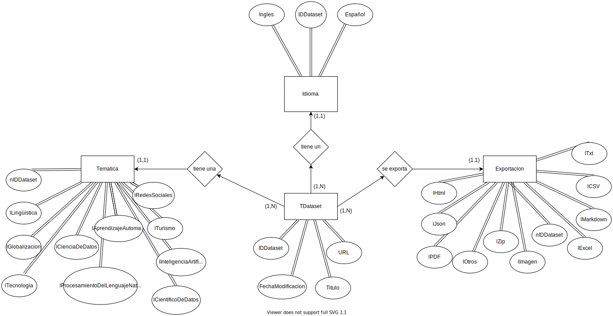
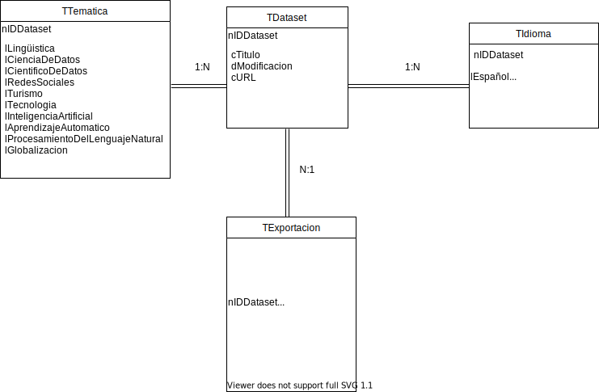

# Los-datos-como-eje-principal-de-la-ciencia-de-datos-en-el-idioma-espa-ol-y-la-IA

# Metodología
La exposición de datos aquí presente tiene como objetivo arrojar información acerca del sesgo cultural que existe entre el inglés y el español para el uso de datos dentro del campo de la inteligencia artificial. Este documento tiene como base nuestra anterior publicación: “El estado del arte de la ciencia de datos en el idioma español y su aplicación en el campo de la Inteligencia Artificial”. Para ello contaremos con una serie de temas: lingüística, redes sociales, turismo, tecnología, globalización, inteligencia artificial, aprendizaje automático, procesamiento del lenguaje natural, ciencia de datos y científico de datos. El objetivo no es solo comprobar el estado de la lengua castellana e inglesa en la inteligencia artificial y áreas relacionadas sino adicionar temas más generalistas que repercuten en muchos más ámbitos y sobre todo generan más interés social. 

El motivo por el cual se ha decidido realizar el estudio en estos 2 idiomas es principalmente la representación que tienen en las sociedades del mundo y por la gran diferencia que existe entre ellas dentro de los temas relacionados con la inteligencia artificial, la tecnología etc. A pesar de que el español es la segunda lengua más hablada en el mundo, pues así lo dice la revista Ethnologue:  

El inglés queda reflejado como lengua de referencia para este tipo de temas, eclipsando por completo al español, a pesar de que su representatividad es más destacable en el conjunto de sociedades del mundo.

Se ha realizado una búsqueda de datasets en función de los temas que anteriormente se han definido, tanto en inglés como español. Los sitios de los que se han extraído los conjuntos de datos son Kaggle, Google Dataset Search y World Bank Open Data. Cada dataset incluido en la muestra trae consigo un título, el tipo de dato en el que se exporta el archivo, el link, la fecha de última actualización, el tema y el idioma.

Tras la búsqueda de una muestra de 100 datasets en la que se recopilan todos aquellos conjuntos de datos que tienen relación con las temáticas elegidas, se procede a presentar una vista dual que aglutine, por un lado, aquellos que están desarrollados en inglés y  por otro, los que están en español. La vista se ha realizado aplicando principalmente el filtro del idioma y la temática, que son los aspectos que fundamentan y dan sentido al presente estudio. La vista se interpreta a modo comparativo, de esta manera se puede comprobar como algunos de los temas buscados en español tienen nula o muy reducida representación en la muestra en comparación con los mismos temas pero desarrollados en inglés. 

# Objetivos 
Nuestro objetivo se centra en resolver la pregunta que antes nos planteábamos: ¿Habla inglés la inteligencia artificial? Los datos expuestos nos hacen llegar a la conclusión de que sí, y que además, con una amplia diferencia en cuanto a otro idioma tan conocido como el español. Sin embargo, más allá de esta cuestión, nos hace plantearnos otras adicionales: ¿Por qué existe esta discriminación hacia el lenguaje español y a favor del inglés en el conjunto de datos?, ¿Qué pueden hacer aquellos investigadores que no dominen el inglés si quieren avanzar en el campo de la inteligencia artificial?, ¿Será posible equilibrar esta situación en el futuro de las tecnologías, el desarrollo y la innovación?

# Datasets
Conjunto de datos en inglés: https://gist.github.com/Itvia/f70d4073d58d252ef788c7dca8d6f7e3

Conjunto de datos en español: https://gist.github.com/Itvia/ea4cf3e28224996be56a2dab36383d43

# Diseño Entidad-Relación
 

# Diseño Físico
 

# Referencias
Epdata. (2021).
https://www.epdata.es/datos/lengua-espanola-mundo-datos-graficos/513
